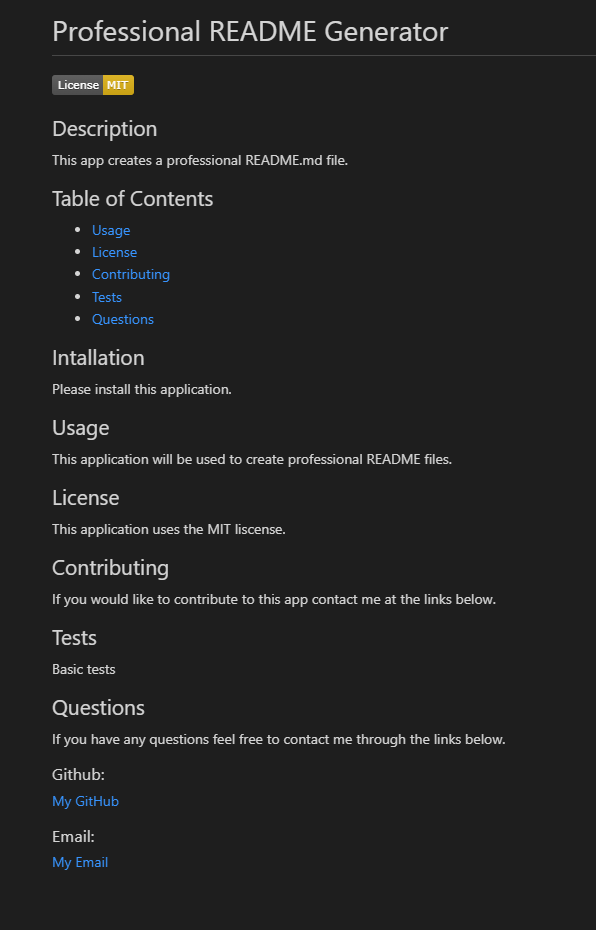
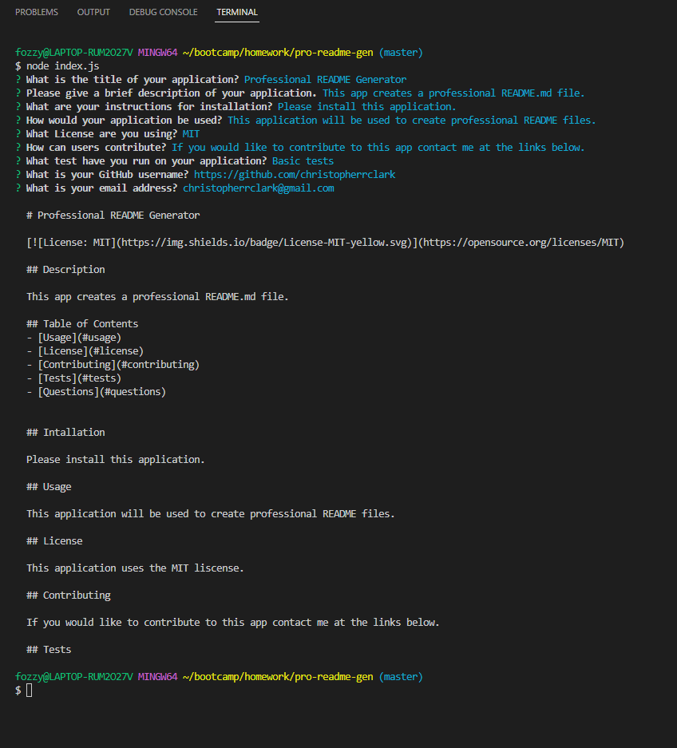

# Professional README Generator

## Project Summary

The goal of this assignment is to use the command-line application to generate a high-quality README.md file from a user's input using the Inquirer package, so the project creator can devote more time to working on the project. 

### Here is the link to the final version of the project.

[Click here to watch a video demonstrating the Professional README Generator.](https://drive.google.com/file/d/1ZMR6dTEOdGhajvGUwZGizIDoQ792xv-S/view)

